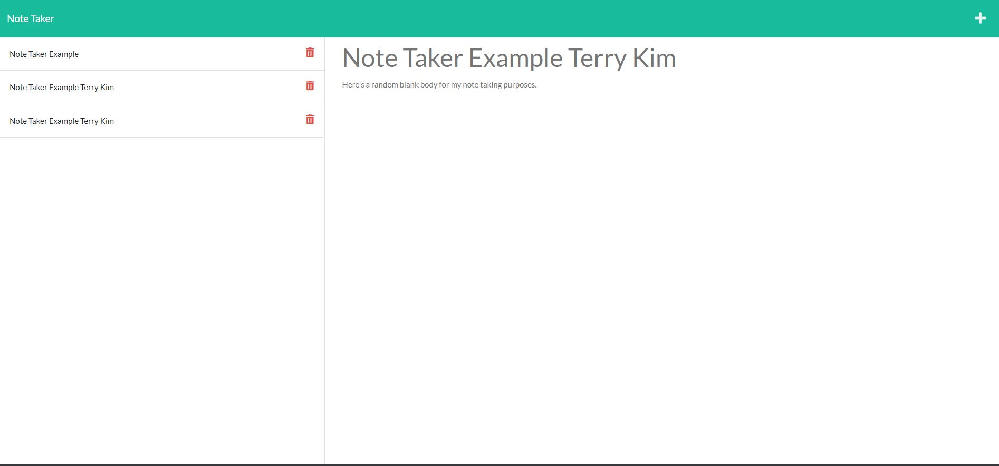

# Note Taker Terry Kim
Note Taker Application by Terry Kim

This server.js file will utilize the html files via starter code to create a note taking app. The note taking app will allow user to input a title and a body for the note taking purpose.
 The option of using Heroku or just LocalHost will work. In this case, Heroku was used as the final uploaded application.

-The user will be able to input a title.

-The user will be able to fill out the body for note taking purposes.

-The user keeps any notes saved. 

-The user can delete any notes.

## Screenshots

Deployed Heroku: https://powerful-chamber-88329.herokuapp.com/notes

## Authors

- [@Terry Kim](https://github.com/TeryKing)

## Acknowledgements

Georgia Tech Coding Bootcamp: https://bootcamp.pe.gatech.edu/coding/

W3Schools: https://www.w3schools.com/

MDN : https://developer.mozilla.org/en-US/

Readme.so: https://readme.so/

## Feedback

If you have any feedback, please reach out to me at Tery_x3@hotmail.com

